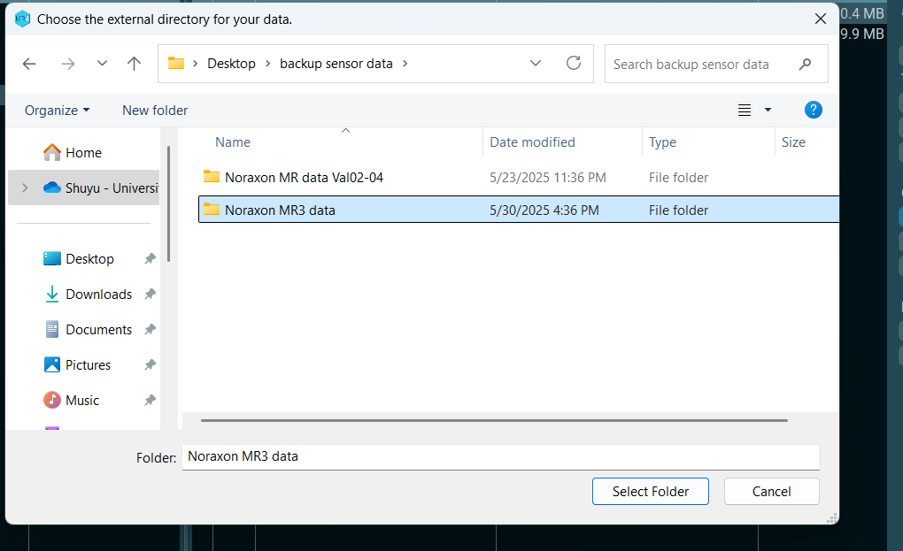
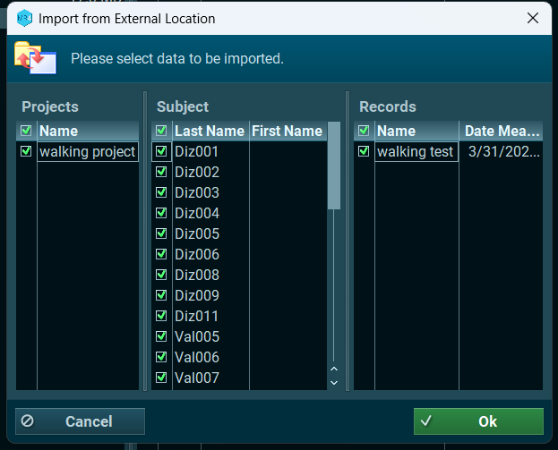

# GaitValidation
repository with data and analysis related to video-based gait analysis 


# Run video-based analysis 
1. download the PosePipeline.ipynb file in the "Scripts" folder
2. input participant's height in the video
   
```python
# set up
height_cm = 166
```

3. modify the location of the folder of the video in the code
   
```python
# Set up directories
input_dir = r"./DEMO"
```

4. run the scipt and get the "feature_results.xlsx" file 


# Run correlation 
1. open analysis.ipynb file in the "Scripts" folder. (optional)
2. output sensor results by using sensor files in the "sensor data" folder and first code cell in the script(optional)
3. load sensor result excel and video analysis result excel under the "feature output" folder 
4. run the code under Correlation-large model.ipynb or Correlation-small model.ipynb file to get correlation and figures 


# Compare differences between patients and healthy control
1. open Analysis-LMM.ipynb file in the "Scripts" folder. 
2. modify this line to the right file in the "LMM analysis" folder 

```python 
df = pd.read_excel(r"./LMM analysis/large model/video_all_df.xlsx", sheet_name="Sheet1")
```

# Import data files into Noraxon software
In the "Database" section, click "Import" in the right column, check "Import from External Location", choose the entire folder that you want to import and click "Select folder". Choose the subject and data and click "OK".




